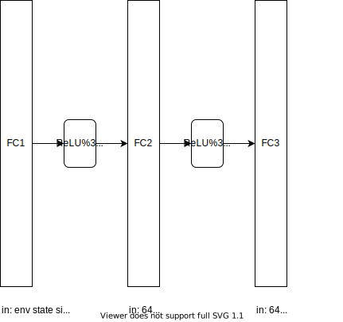

# Report

## Summary

An agent is trained to  navigate (and collect bananas!) in a large, square world. A Banana Collector environment of the
Unity ML Agents Toolkit 

A reward of +1 is provided for collecting a yellow banana, and a reward of -1 is provided for collecting a blue banana.  Thus, the goal of the agent is to collect as many yellow bananas as possible while avoiding blue bananas.  

The state space has 37 dimensions and contains the agent's velocity, along with ray-based perception of objects around agent's forward direction.  Given this information, the agent has to learn how to best select actions.  Four discrete actions are available, corresponding to:
- **`0`** - move forward.
- **`1`** - move backward.
- **`2`** - turn left.
- **`3`** - turn right.

The task is episodic, and in order to solve the environment, the agent must get an average score of +13 over 100 consecutive episodes.

## Implementation

Agent implements a vanilla DQN (Deep Q Network). DQN consists of multilayer neural network, which outputs an action value vector for given state `s`. DQN algorithm uses a replay buffer along with two identical neural network called as local and target neural network. Target network is used as a reference. Target network parameter `θ`- are same as local network but they are kept constant for `t_steps` after that they are update with parameter `θ` of local network.

### Model Configuration
The model takes state space as input, for the banana environment we having 37 dimensions. The dimensions defines the velocity, yellow banana, blue banana, walls, other agents, etc. The output is the action.Use ReLU as an activation function.

### Learning Algorithm
#### Action 
An agent `act` on an environment with current state which gives us `states, actions, rewards, next_states, dones`. The action is the output of `qnetwork_local` which is switched to evaluation mode when acting. `qnetwork_local` is switched back to train mode.

##### Exploration vs. Exploitation

`ε-greedy` policy is used for action selection. At start the model is not mature to make a decision for us.`ε` controls exploration and exploitation. In initial state the policy tends to use exploration which is basically a random function deciding which action to pick. As the agent progress, the `ε` will favour exploitation. 

#### Step
The agent learns after every `t_step`. The agent learns from past experiences. Here, Experiences are the env info after each action. These experiences are store in a memory called `ReplayBuffer`.

##### Replay Buffer
Replay buffer is a Double Ended Queue. The `ReplayBuffer` size is defined as the maximum number of experience that are to be remembered. As new experience are added the old one's are erased when the buffer is full. `ReplayBuffer` is used to sample some of those experiences randomly in batches. If sampled sequentially, it would sway away the agent due to the corelation between the consecutive experience. The learning step starts after the `ReplayBuffer` is full. 

#### Learn
`qnetwork_local` and `qnetwork_target` are of same network configuration. `qnetwork_target` gives the actions for `next_state` from sampled experience and choose max for those actions for each experience. Temporal difference value for target network `Q_targets` is calculated with reward and discount. `Q_expected` are the q values for the `states` and `actions` from experience. Mean Square Error Loss is calculated with `Q_targets` and `Q_expected`. The loss is backpropogated through the `qnetwork_local`.  

##### Update
`qnetwork_target` weights are updated with new weights of `qnetwork_local`. The `tau` adds stability to the network. `qnetwork_target` weights are updated by only adding a fraction of the current value to the target

## Training

The agent is set to the training mode. The Unity env stores `env_info` the state respective to the `brain`. Used a default brain `0` for training. The agent is trained with `n_episodes` episodes and each episode being of `max_t` timestep. Reset the score. Reset the environment in train mode. Provide the `action` obtained from agent by submitting `state`. Act on the env with that `action`. `env_info` is recorded and are passed to the agent for learning. Set the `state` to  `next_state` and the add reward to score.

### Hyperparameter

 Parameter name  | Value
 ------------ | -------------
 BUFFER_SIZE | int(1e5)
 BATCH_SIZE | 64
 GAMMA | 0.99
 TAU | 1e-3
 LR | 5e-4
 UPDATE_EVERY | 4
 n_episodes | 2000
 max_t | 1000
 eps_start | 1.0
 eps_end | 0.01
 eps_decay | 0.995
 seed | 0

Above hyper parameter are used for training the agent.

## Observations

* DQN performed well and with some random score
* DDQN was able to perform better than DQN. 
* With DDQN, Agent in the initial state gave constant score. the score was not that random as DQN
* In evaluation, DDQN performs well than DQN

DQN | DDQN
 ------------ | -------------
|
Episode 531	Average Score: 13.01|Episode 480	Average Score: 13.01
Environment solved in 431 episodes! | Environment solved in 380 episodes!

## Future Work
For further improvement following fields could be investigated.
* The Neural networks could go deeper, __more hidden layers__. This could give an ability to capture and learn more possibilities.
* As we make the network deeper, __batch normalization__ would help in training this network. 
* Sometimes the agent doesn't do anything even if the score in not achieve. That will be looked into
* __Duelling__ can be implemented.

